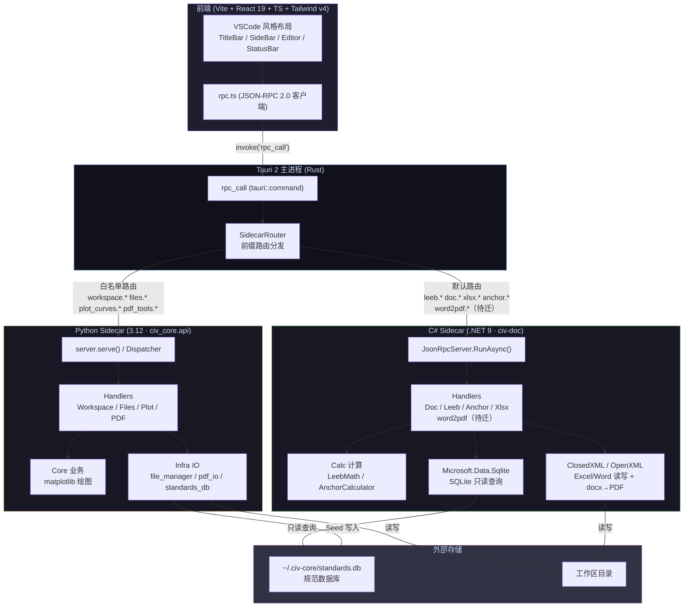

# civ-core（筑核）

土木检测内业报告自动化工具。接收 Excel/CSV/Word，自动完成数据格式化、规范评定、报告填充。
Windows 平台，内部自用，非编程人员操作。

**角色**：本文件是 AI 的宪法级上下文。放不可变的架构规则和边界。≤4000 字。每次会话必读。
**配套文件**：`.ai/RULES.md`（编码规范+清单）| `.ai/PROGRESS.md`（里程碑）| `.ai/CONTEXT.md`（当前焦点）
**子域规则**：`dotnet/CLAUDE.md` | `frontend/CLAUDE.md`（仅在操作对应目录时加载）

---

## 架构

**双 sidecar 通过 stdin/stdout JSON-RPC 2.0 行协议通信。同协议、同错误码。前端不感知 sidecar 边界。Python 负责 standards.db 初始化写入，C# 以只读方式查询。**

## 技术栈

- Python 3.12+, `uv` 管理，禁 pip install
- C# .NET 9, ClosedXML 0.105, Microsoft.Data.Sqlite 10.0
- 前端 Vite + React 19 + TypeScript + Tailwind v4 + @vscode/codicons
- 主进程 Tauri 2.11 (Rust)
- JSON-RPC 2.0 over stdin/stdout，行协议

## RPC 路由

**策略：默认 C#，白名单 Python。** 未来新 calc 类型不加 Rust 代码。

| sidecar | 方法前缀 |
|---------|---------|
| **C#（默认）** | `leeb.*` `doc.*` `xlsx.*` `calc.*` `word2pdf.*`（待迁）— 及所有未列出的新方法 |
| **Python（白名单）** | `ping` `version` `workspace.*` `files.*` `plot_curves.*` `pdf_tools.*` |

## 不可变规则

1. **依赖方向**：`frontend → Tauri → sidecar → core/infra_io/domain`。禁反向 import。禁跨 sidecar 共享内存状态。

2. **handler `__all__`**：每个 `api/handlers/*.py` 顶部显式写 `__all__`。不写会把 `import Path` 暴露成 RPC 方法。

3. **`run()` 必须 return 值**：前端工具 controller 的 `run()` 签名必须是 `Promise<RunRes | null>`，不准靠闭包读 `this.state`。

4. **图标**：只用 @vscode/codicons 真实存在的名字。`calculator` 不存在→用 `symbol-method`。

5. **stdout 是协议流**：Python `api/__main__.py` 只挂 file+stderr logger；C# `Program.cs` 只写 `Console.Error`。绝不动 stdout。

## 会话自检（每次开工前回答）

- [ ] 这个功能走 Python 还是 C#？前缀配对了吗？
- [ ] handler 写了 `__all__` 吗？
- [ ] 前端 `run()` 是 `return` 值还是读闭包？

## 工作流

1. 会话开始：`git add -A && git commit -m "chore: 会话检查点"` → 读本文件 + `.ai/CONTEXT.md` → 报告状态→确认后动手
2. 单步完成：`git add -A && git commit -m "feat: xxx"`（不用 emoji）
3. 改 Python：`uv run --frozen ruff check . && uv run --frozen pytest -q && uv run --frozen python scripts/healthcheck.py`
4. 改 C#：`cd dotnet/civ-doc && dotnet build && dotnet test`
5. 改 Rust：`cd frontend/src-tauri && cargo check && cargo test --lib`
6. 改前端：`cd frontend && npx tsc -b --noEmit`
7. 阶段结束→更新 `.ai/CONTEXT.md`；里程碑完成→更新 `.ai/PROGRESS.md`

## 边界

| 禁止 | 必须 |
|------|------|
| 没方案就改代码 | 先报告方案→确认→执行 |
| core/ 直接读写文件 | IO 全走 infra_io/ |
| api/handlers/ 直接做计算 | 调 core/ |
| stdout 写日志 | stderr 或文件 |
| pip install / 顶层 import pandas | uv add / lazy import |
| 跨 sidecar 共享全局变量 | 共享状态走 `~/.civ-core/` 文件 |
| 大文件 `f.read()` 一把梭 | generator / 流式 |
| 中国源直连 | 用镜像（见 `.ai/RULES.md`） |
