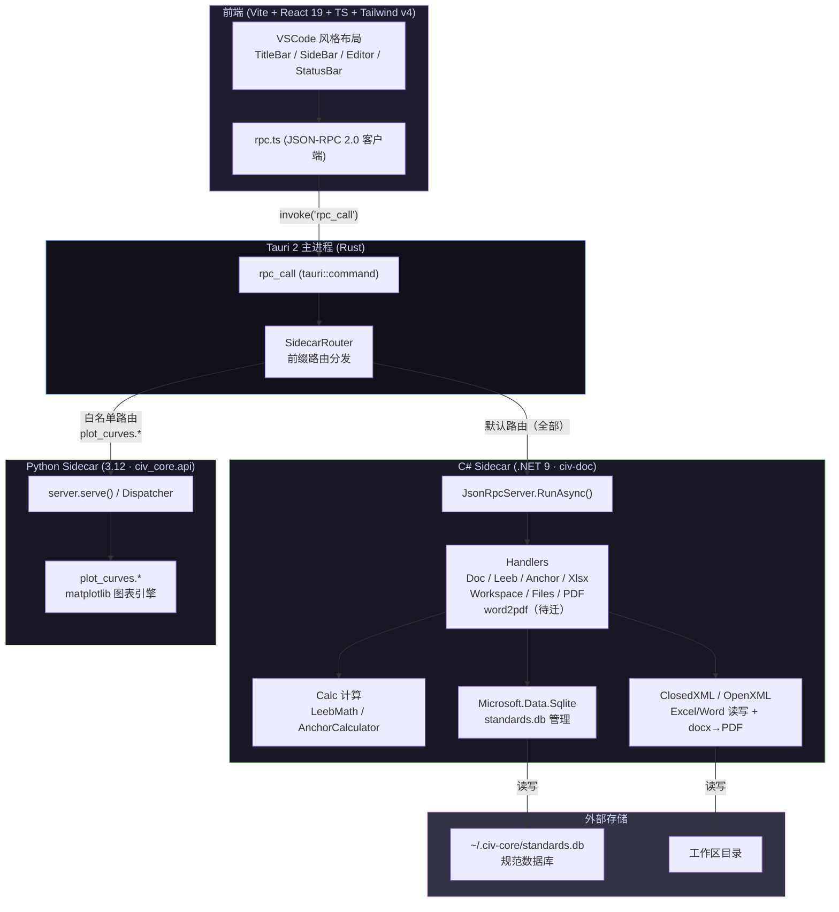

# civ-core（筑核）

土木检测内业报告自动化工具。接收 Excel/CSV/Word，自动完成数据格式化、规范评定、报告填充。
Windows 平台，内部自用，非编程人员操作。

**角色**：本文件是 AI 的宪法级上下文。放不可变的架构规则和边界。≤4000 字。每次会话必读。
**配套文件**：`.ai/ROADMAP.md`（产品路线图）| `.ai/RULES.md`（编码规范+清单）| `.ai/PROGRESS.md`（里程碑）| `.ai/CONTEXT.md`（当前焦点）| `docs/plans/`（技术方案）
**子域规则**：`dotnet/CLAUDE.md` | `frontend/CLAUDE.md`（仅在操作对应目录时加载）

---

## 架构

**双 sidecar 通过 stdin/stdout JSON-RPC 2.0 行协议通信。同协议、同错误码。前端不感知 sidecar 边界。Python 仅保留 plot_curves（matplotlib 图表引擎），其余全由 C# 接管（含 standards.db 管理）。**

## 领域约束

### 工程特点

**1. 出错代价是工程事故。** 报告判错了合格/不合格，现场可能按错的参数施工。每一步必须可追溯——哪组数据、走了哪个规范公式、得出什么判定——能往回查。程序不能是黑盒。

**2. 报告格式由甲方定。** 每个甲方有自己的 Word 模板。行高列宽、合并单元格、签字栏位置全不一样。程序不能假设「表头在第三行」——它得能适应任何甲方给的模板。

**3. 规范是活的。** 同一组数据，换本规范就可能从合格变不合格。计算和规范必须严格绑定——选什么规范出什么结果，不能混。

### 行业风险

| 风险 | 规避方式 |
|------|---------|
| 规范用错 | 锁定规范版本，报告注明判定依据 |
| 项目数据串位 | 工作区隔离，一项目一文件夹 |
| 公式实现错误 | 判定路径全覆盖测试 |
| 用户看不懂程序在干嘛 | 每步出日志，判定结果附公式和中间值 |

### 模块耦合

这个产品不是工具箱——不是把各种功能丢在一起、各用各的。它是**一条装配线**。

上一个模块的输出是下一个模块的输入：原始数据 → 结构化结果 → 曲线图 → 表格模版 → 文字模版 → 完整报告。**修改一个模块的输出格式，下游所有模块都可能受影响。** 模块之间的接口——数据怎么从上一个传到下一个——跟模块本身同等重要，每次改动必须评估对整条线的影响。

## 技术栈

- Python + uv（禁 pip install）
- C# .NET + ClosedXML + Microsoft.Data.Sqlite
- 前端 Vite + React + TypeScript + Tailwind + codicons
- 主进程 Tauri (Rust)
- JSON-RPC 2.0 over stdin/stdout

## RPC 路由

**策略：默认 C#，白名单 Python。** 未来新 calc 类型不加 Rust 代码。

| sidecar | 方法前缀 |
|---------|---------|
| **C#（默认）** | 全部方法 — `leeb.*` `doc.*` `xlsx.*` `anchor.*` `workspace.*` `files.*` `pdf_tools.*` `word2pdf.*`（待迁）— 及所有新方法 |
| **Python（白名单）** | `ping` `version` `plot_curves.*`（唯一保留，matplotlib 无可替代） |

## 不可变规则

1. **依赖方向**：`frontend → Tauri → sidecar → core/infra_io/domain`。禁反向 import。禁跨 sidecar 共享内存状态。

2. **handler `__all__`**：每个 `api/handlers/*.py` 顶部显式写 `__all__`。不写会把 `import Path` 暴露成 RPC 方法。

3. **`run()` 必须 return 值**：前端工具 controller 的 `run()` 签名必须是 `Promise<RunRes | null>`，不准靠闭包读 `this.state`。

4. **图标**：只用 @vscode/codicons 真实存在的名字。`calculator` 不存在→用 `symbol-method`。

5. **stdout 是协议流**：Python `api/__main__.py` 只挂 file+stderr logger；C# `Program.cs` 只写 `Console.Error`。绝不动 stdout。

## 会话自检（每次开工前回答）

- [ ] 这个功能走 Python 还是 C#？前缀配对了吗？
- [ ] handler 写了 `__all__` 吗？
- [ ] 前端 `run()` 是 `return` 值还是读闭包？

## 行为准则

### 1. 先想再动手
不确定就问，别猜。有多个方案就列出来比，别自作主张。
觉得哪里不对直接说出来，推回去也要说为什么。

### 2. 最简方案
只写被要求的东西。别为「以后可能用」加功能。
单次调用的代码不做抽象。200 行能缩到 50 就缩。

### 3. 手术刀改动
只碰跟你任务相关的代码。
不改相邻代码的格式和注释——哪怕你觉得不好。
不该删的东西别删。你造成的 orphan 自己清，跟你无关的 dead code 别碰。

### 4. 跑通才算完
把任务转成可验证目标：「加校验」→「先写失败测试，再让它过」。
每一步有验证点。跑通验证才算这步完了，没跑通别往下一步走。

## 边界

| 禁止 | 必须 |
|------|------|
| 没方案就改代码 | 先报告方案→确认→执行 |
| core/ 直接读写文件 | IO 全走 infra_io/ |
| api/handlers/ 直接做计算 | 调 core/ |
| stdout 写日志 | stderr 或文件 |
| pip install / 顶层 import pandas | uv add / lazy import |
| 跨 sidecar 共享全局变量 | 共享状态走 `~/.civ-core/` 文件 |
| 大文件 `f.read()` 一把梭 | generator / 流式 |
| 中国源直连 | 用镜像（见 `.ai/RULES.md`） |
