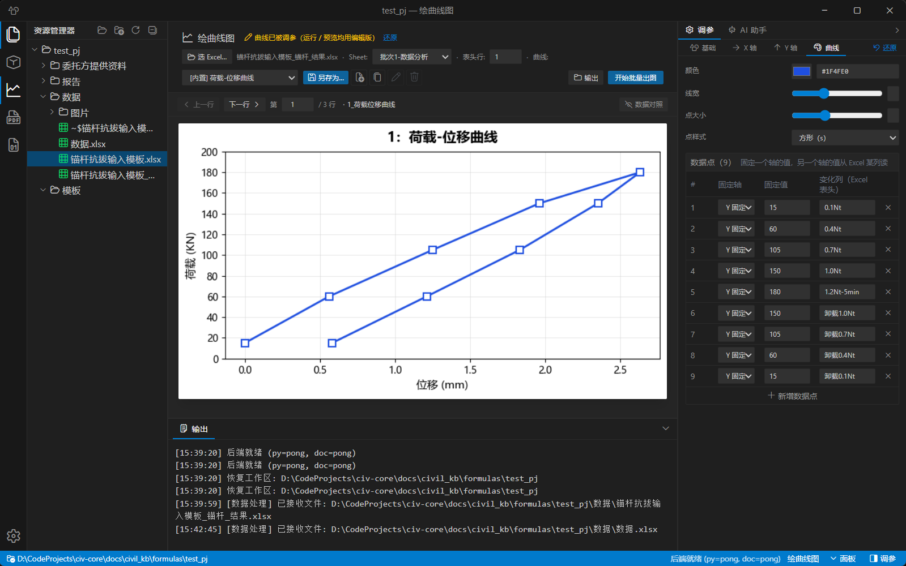
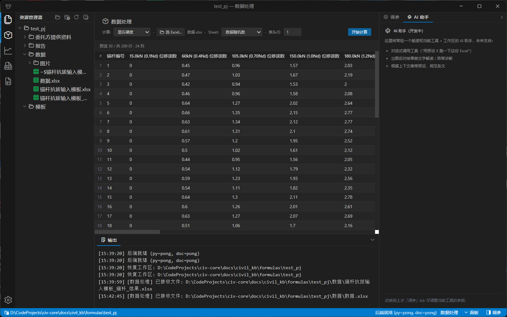

<p align="center">
  <!-- TODO: Logo / Banner -->
</p>

<h1 align="center">筑核 · civ-core</h1>

<p align="center">
  
  
  
</p>

<p align="center">
  
  
  
</p>

<p align="center">
  
  
  
</p>

<p align="center">
  
  
  
  
</p>

<p align="center">
  <a href="https://star-history.com/#ZGQ2001/civ-core&Date">
    
  </a>
</p>

---

**筑核** 是面向土木工程检测行业的桌面端内业报告自动化工具。

> Excel / CSV 拖入 → 一键评定 → Word 报告 + 曲线图

告别手工核对规范和逐页填 Word：软件自动完成数据读取、规范查表、强度推定、图表生成、报告填充全流程。

---

## 📸 界面预览

<p align="center">
  
  
</p>

*左：曲线图工具，支持多曲线叠加、轴范围滑块、实时预览。右：数据处理工具，里氏硬度 / 锚杆抗拔模式。*

---

## 📥 下载安装

从 [Releases](https://github.com/ZGQ2001/civ-core/releases) 下载最新版 `civ-core_Setup.exe`：

1. 双击安装（会自动创建桌面快捷方式）
2. 首次启动会自动初始化规范数据库（`standards.db`）
3. 无需安装 Office——Excel/Word 读写走 OpenXML 原生引擎

> 系统要求：Windows 10+ / macOS 12+ / Linux（Wayland/X11），无需 .NET Runtime，无需 Python。

---

## 🧰 功能

### 📊 曲线图工具

检测数据 Excel → 批量出图 PNG。

- 拖入 Excel，选 Sheet → 选曲线模板 → 点运行
- 支持轴范围滑块、曲线颜色/线型自定义、DPI 设置
- 预览区实时刷新，导出前所见即所得

**输入**：任意格式 Excel（`.xlsx` / `.xls`）
**输出**：高清 PNG 曲线图，按行索引批量生成

---

### 🔩 里氏硬度推定（INSP-001）

钢材里氏硬度 → 抗拉强度换算。

- 读入里氏硬度 Excel → 自动解析测区/构件/批次结构
- 查《黑色金属硬度及强度换算表》→ 角度修正 → 厚度修正 → 截尾平均
- 一键生成带合并单元格的标准报告表

**输入**：里氏硬度检测 Excel
**输出**：`_里氏硬度推定结果.xlsx`（含汇总 + 明细）

---

### ⚓ 锚杆抗拔试验

依据 GB 50086-2015《岩土锚杆与喷射混凝土支护工程技术规范》。

- 读入锚杆检测 Excel → 填写 basic info → 生成 Word 模板
- 自动填入委托信息、工程概况、检测数据表、结论与建议
- 支持模板自定义（通过 `templates/` 目录管理）

**输入**：锚杆检测 Excel + 工程基本信息
**输出**：锚杆抗拔检测报告 `.docx`

---

### 🪨 钻芯法（INSP-002）

混凝土芯样抗压强度推定。

**输入**：芯样数据 Excel
**输出**：钻芯法检测报告

---

### 🔄 回弹法（INSP-003）

混凝土回弹强度推定。骨架已就绪，验收评定逻辑开发中。

---

### 📄 Word → PDF

选中 `.docx` 文件 → 一键批量转 PDF。

**输出**：同目录下生成同名 `.pdf`

---

### 📎 PDF 工具

- **合并**：多选 PDF → 按顺序拼成一个
- **分拆**：一个 PDF → 按页码范围拆分，或每页独立

---

## 🛠 开发

### 技术栈

| 层 | 选型 |
|---|------|
| UI | React 19 · TypeScript · Tailwind v4 |
| 桌面壳 | Tauri 2.11 · Rust |
| 计算引擎 | C# · .NET 9 · ClosedXML · OpenXML SDK |
| 图表引擎 | Python 3.12 · matplotlib |
| 通信协议 | JSON-RPC 2.0（stdin/stdout 行协议） |
| 数据库 | SQLite（Microsoft.Data.Sqlite） |
| 测试 | pytest（Python） · xUnit（C#） · ruff |
| CI | GitHub Actions（Windows） |

### 架构

```
🖥 React UI  ──JSON-RPC──▶  ⚙️ Tauri 2
                                ├── 默认 → 🔧 C# .NET 9（计算 / Excel / Word / SQLite）
                                └── 白名单 → 📊 Python 3.12（matplotlib 图表）
                                              └── 💾 standards.db
```

前端不感知后端语言边界。C# 负责全部计算和文档读写，Python 仅保留 matplotlib 图表引擎。

### 启动

```bash
bash run.sh                        # 一键（Tauri + Vite + 双 sidecar）
cd frontend && npm run tauri:dev   # 手动
```

### 命令行

```bash
uv run pytest                      # 跑测试
uv run ruff check .                # 代码检查
cd dotnet/civ-doc && dotnet test   # C# 测试
```
