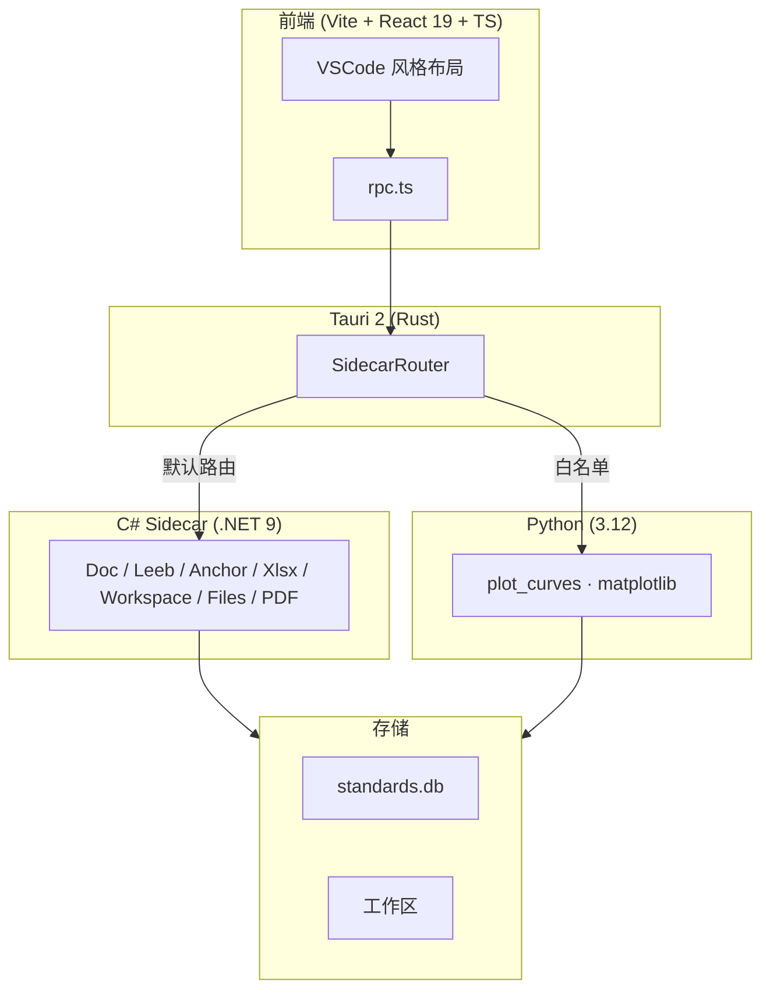

# 筑核（civ-core）


[](https://star-history.com/#ZGQ2001/civ-core&Date)

土木工程检测内业报告自动化工具。

输入 Excel/CSV/Word → 自动完成数据格式化、规范评定、图表生成、Word 报告填充。

---

## 📸 功能截图

### 曲线图工具


### 数据处理（里氏硬度 / 锚杆抗拔）


---

## 🚀 快速上手

1. 从 [Releases](https://github.com/ZGQ2001/civ-core/releases) 下载最新版
2. 解压运行 `civ-core.exe`
3. 选择工具 → 导入数据 → 一键出报告

---

## 🧰 功能

| 工具 | 说明 |
|------|------|
| 📊 绘图工具 | 导入 Excel → 选曲线模板 → 批量出图 PNG |
| 🔩 里氏硬度 (INSP-001) | 钢材硬度 → 抗拉强度推定，多批/角度/厚度修正 |
| 🪨 钻芯法 (INSP-002) | 混凝土芯样抗压强度推定 |
| 🔄 回弹法 (INSP-003) | 混凝土回弹强度推定（骨架就绪） |
| ⚓ 锚杆抗拔 | GB 50086-2015 抗拔试验计算 |
| 📄 Word → PDF | 批量转换 |
| 📎 PDF 工具 | 合并 / 分拆 |
| 📁 工作区管理 | 自动创建项目文件夹结构 |

---

## 🛠 开发

### 技术栈

| 层 | 技术 |
|---|---|
| 前端 | Vite + React 19 + TypeScript + Tailwind v4 |
| 桌面壳 | Tauri 2.11 (Rust) |
| 主计算引擎 | C# .NET 9 + ClosedXML + OpenXML SDK |
| 图表引擎 | Python 3.12 + matplotlib |
| RPC 协议 | JSON-RPC 2.0 over stdin/stdout |
| 数据库 | SQLite (Microsoft.Data.Sqlite) |
| 测试 / Lint | pytest / ruff / xUnit |
| CI | GitHub Actions (Windows) |

### 架构



### 启动开发环境

```bash
bash run.sh
# 或
cd frontend && npm run tauri:dev
```

### 命令行（脱壳模式）

```bash
uv run python -m civ_core.main --list-presets
uv run python -m civ_core.main --tool plot_curves --input data.xlsx --preset 预设名 --output ./输出/
uv run pytest
uv run ruff check .
```

### 目录结构

```
civ-core/
├── frontend/          React UI + Tauri 主进程
├── src/civ_core/      Python sidecar（api/core/infra_io/domain）
├── dotnet/civ-doc/    C# sidecar（Handlers/Calc/ReportTables）
├── docs/              土木知识库 + 开发日志
├── tests/             300+ pytest
├── presets/           系统预设
└── ~/.civ-core/       用户数据
```
