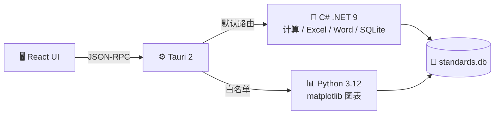

<p align="center">
  <!-- TODO: Logo / Banner -->
</p>

<h1 align="center">筑核 · civ-core</h1>

<p align="center">
  
  
  
</p>

<p align="center">
  
  
  
</p>

<p align="center">
  
  
  
</p>

<p align="center">
  
  
  
  
</p>

<p align="center">
  <a href="https://star-history.com/#ZGQ2001/civ-core&Date">
    
  </a>
</p>

---

土木工程检测内业报告自动化工具。

> **Excel / CSV / Word → 自动数据格式化 → 规范评定 → 图表生成 → Word 报告填充**

---

## 📸 界面预览

<p align="center">
  
  
</p>

---

## 🚀 快速上手

1. [下载最新版](https://github.com/ZGQ2001/civ-core/releases)
2. 解压，双击 `civ-core.exe`
3. 选择工具 → 导入数据 → 一键出报告

---

## 🧰 功能

| | 工具 | 说明 |
|---|------|------|
| 📊 | **绘图工具** | Excel 数据 → 曲线图批量导出 |
| 🔩 | **里氏硬度** `INSP-001` | 钢材硬度 → 抗拉强度推定 |
| ⚓ | **锚杆抗拔** | GB 50086-2015 抗拔试验计算 |
| 🪨 | **钻芯法** `INSP-002` | 混凝土芯样抗压强度 |
| 🔄 | **回弹法** `INSP-003` | 混凝土回弹强度（开发中） |
| 📄 | **Word → PDF** | 批量转换 |
| 📎 | **PDF 工具** | 合并 / 分拆 |

---

## 🛠 开发

### 技术栈

| 层 | 选型 |
|---|------|
| UI | React 19 · TypeScript · Tailwind v4 |
| 桌面壳 | Tauri 2.11 · Rust |
| 计算引擎 | C# · .NET 9 · ClosedXML · OpenXML SDK |
| 图表引擎 | Python 3.12 · matplotlib |
| 通信协议 | JSON-RPC 2.0 (stdin/stdout 行协议) |
| 数据库 | SQLite |
| 测试 | pytest · ruff · xUnit |
| CI | GitHub Actions (Windows) |

### 架构



### 启动

```bash
bash run.sh                    # 一键启动
cd frontend && npm run tauri:dev  # 或手动
```

### CLI

```bash
uv run pytest                  # 跑测试
uv run ruff check .            # 代码检查
uv run python -m civ_core.main --tool plot_curves --input data.xlsx --preset 预设名
```
